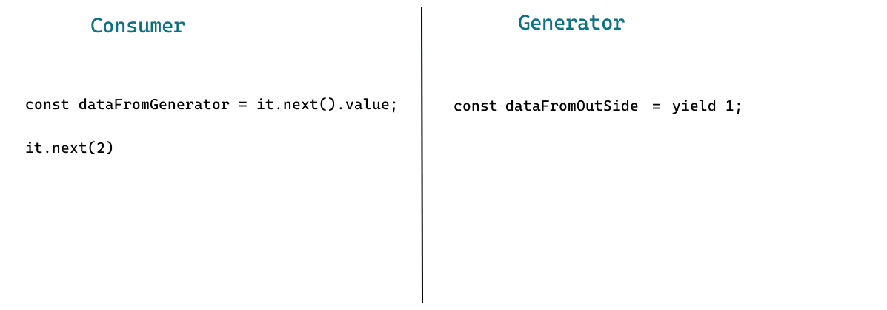
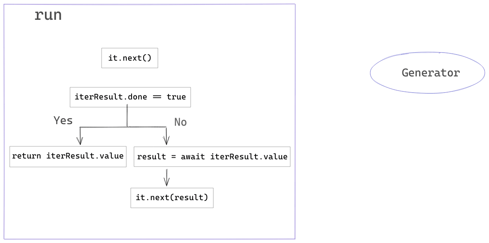

# Why generators matters

In a previous [article](https://dev.to/omenlog/why-we-have-generators-3bg6) I described the concept of generator in JS, there was explain the strong relation that exists between **Iterators**, **Iterables** and **Generators**.
Now in this post I want to focus on one specific feature that make generators unique inside of JS landscape, this is:

<center>
    <h2>Bidirectional communication</h2>
</center>

## Push and Pull protocols

In order to understand what bidirectional communication(BC) is we should know about `Push` and `Pull` as communication protocols, between data producers and consumers.

With `Pull` the consumer is who determine when the data is received from the producer.
Functions are the simpler example of pull in JS. When we use a function `F` , `F` it is unaware of when the data will be produced or in another way `F` doesn't know when it will be executed, the consumer has all responsibility over the `F()` call to pull the data.

In the other hand with `Push` the producer has full control over the moment when the data is produced, the consumer doesn't know neither when or how the data is produced.
As example of `Push` in JS we have `Promises`.
When we use a promise `P` a callback is passed to `then`, later at some point this callback will be executed with data when the promise is fulfilled, in this case our callback doesn't know anything about how the data was produced, the inner implementation of promises determine when data is pushed to our callback.

> Iterables are another example of `Pull` and Observables works as a `Push` mechanism.

## Bidirectional communication using generators

Bidirectional communication over generators is based on the fact that they support `Pull` and `Push` at the same time, or in other words generators can be at the same time data consumers and data producers.

First let's see an example of generators as data producers:

```js
function* producerGen() {
  yield 1;
  yield 2;
  yield 3;
}

function consumer() {
  const it = producerGen();

  console.log(it.next()); // {done: false, value:1 }
  console.log(it.next()); // {done: false, value:2 }
  console.log(it.next()); // {done: false, value:3 }
}
```

In this example our generator is only acting as producer, the values are consumed inside of `consumer` function and here we have a pulling happening through our `it` variable.

Now let's see how a generator can consume data and producing as well:

```js
function* generator() {
  const dataFromOutSide = yield 1;
  console.log(dataFromOutSide); // 2
}

function consumer() {
  const it = generator();

  const dataFromGenerator = it.next().value;

  console.log(dataFromGenerator); // 1

  it.next(2);
}

consumer();
```

Let's analyze this piece of code step by step.
First we get an iterator `it` from our `generator` function.
The first call to `it.next()` run our `generator` till the point when it reach the `yield` keyword, at this point the execution of `generator` is paused and `1` is send to outside, acting our `generator` in its roll as data producer.
Then we continue log the value obtained from `generator` and call `next` again but passing an argument to it `it.next(2)`, when `next` is called with an argument `generator` execution is resumed, and also the previous `yield` expression is replaced using `next` argument, in this example `yield 1` will be replaced by `2` so the variable `dataFromOutside` will receive this value.



In this gif we can appreciate the communication flowing in both directions from side to side, so is clear how our `generator` produce and consume data, in fact `consumer` function is also a producer.

## Advantages of bidirectional communication

Now after understand this feature, someone might wonder _What benefits bidirectional communication give us ?_, and the answer is:

- separation of concern
- inversion of control
- code easier to test
- high level of decoupling

As example I'll implement a function two times one using `async-await` and another using generators, in order to analyze what we gain from bidirectional communication in the generator based implementation.
Suppose that we have a function to get user data, first we check if the user is in cache if not then we request it from server.

```js
async function getUserData(userId) {
  const userOnCache = await cache.get(`user:${userId}`);

  if (!userOnCache) {
    const userFromBackend = await server.getUser(userId);
    return userFromBackend;
  }

  return userOnCache;
}
```

> _Error handling not covered for simplicity_

Now let's think about this function but with unit tests in mind.
First thing to note is that `getUserData` depends on `cache` and `server`, is known that during unit tests we must avoid any call to backend and also any read against our cache storage, therefore to test this function in isolation we should mock it's dependencies.
But mocking is a big topic in software development, we have many libraries dedicated to make easier mocks creation and in other hand there are some opinions about [mocking as a code smell](https://medium.com/javascript-scene/mocking-is-a-code-smell-944a70c90a6a), besides all of this, developers claiming that tests as a difficult task is a fact, mainly in situation when they have a implementation with high level of coupling, in several cases when should be implemented many mocks, developers don't enjoy the testing process or worse they decide not to test the code at all.

> We could implement `getUserData` using some sort of dependency injection making our function easier to test but this topic is out of the scope.

After this implementation using `async-await` and conclude that we need mocks for unit test
let's see what happen when we use generators. To transform our example to a generator based one we only need to replace `async` by `function*` and every `await` sentence by `yield`.

```js
function* getUserData(userId) {
  const userOnCache = yield cache.getUser(`user:${userId}`);

  if (!userOnCache) {
    const userFromBackend = yield server.getUser(userId);
    return userFromBackend;
  }

  return userOnCache;
}
```

Now our function is a generator that will `yield` promises. Write unit tests for this function is simple, for example let's write a test for the use case when we don't have user data in cache so we get our user from the server.

```js
import { getUserData } from './get-user-data';

it("should get user data from backend when user isn't cached", () => {
  // fake user data
  const userData = { name: 'Jhon', lastName: 'Doe' };

  // get an iterator from our generator, remember this iterator will give us promises
  const it = getUserData('user123');

  // run our generator til the first yield
  it.next();

  // resume our generator execution passing undefined as data
  it.next(undefined);

  // resume our generator passing to it userData simulating the server response,
  // also retrieve the next value emitted by our generator,
  // at this point this value come from the return statement
  const { value } = it.next(userData);

  // check that our function return the correct data
  expect(value).toEqual(userData);
});
```

This show how easy is to test our code using bidirectional communication.
The difference is that in our `async` and `await` example we send promises to JS engine that will be in charge to resolve them and resume our async function, in this case we can't intercept this communication with the engine so for test our units in isolation we recur to mocks of our dependencies.
In other hand with generators we have full control over the promises yielded by `getUserData` so they can be intercepted allowing pass to our generator whatever kind of data, indeed `getUserData` is totally unaware is the promise was resolved or is fake data being injected.

Could seem like with this approach we end with a brittle test very coupled to our implementation, because we need manually call `next` based on the amount of `yield` in our generator also for every call we should manually pass with the correct type of data, having this as a consequence that a little change in our implementation may break our test.
For sure this is true indeed our test can be improved, but remember that I'm only showing how powerful BC is, maybe I cover this topic in a future post.

One drawback of generators is that with `async` functions we can invoke it and the language knows how to execute them, awaiting and resuming promises automatically.
The same isn't true for generators, I mean JS doesn't what kind of values our generator will produce and what should be done with them, so we as developers are in charge to get data and resume the execution of our generators, but don't worry if we know what type of values will be yielded then we can implement a function that pull values from our generator and resume it automatically.

> This idea of write generator runners is not new and is used by some [libraries](https://www.npmjs.com/package/co)

Let's see a simple `run` function that can execute our generators.

```js
async function run(iterator) {
  let iteratorResult = it.next();

  while (!iteratorResult.done) {
    const result = await iter.value;
    iteratorResult = it.next(result);
  }

  return iteratorResult.value;
}
```

`run` will receive an `iterator`, then we get the first data using `next()`, after that we keep retrieving data from `iterator` while it isn't done, for every piece of data we `await` the property `value` to resume our generator passing the promise `result` in the `next` call, by last we return the last value emitted by `iterator`.



With run implemented we can

```js
run(getUserData('user123')).then((userData) => {});
```

## Conclusions

In summary this post explained very briefly `Pull` and `Push` as communication protocols, described how BC works on generators and how this feature allow us transform a generator in data producer and data consumer. After that the advantages we talked about the advantages that BC offer and an example about how we can using generators to imitate async and await was show, with this example we saw how easy is to test a generator based implementation. By any mean this post is a comparative between generators and async-await, async-await is a very powerful feature indeed I used it to implement `run` function and also I use it in my every day job. Hopefully
